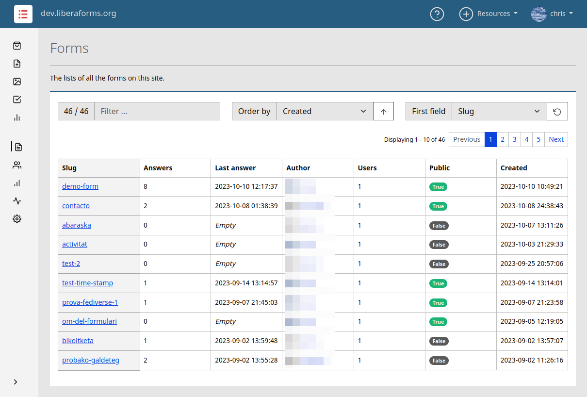

<!--
Nota bene : ce README est automatiquement généré par <https://github.com/YunoHost/apps/tree/master/tools/readme_generator>
Il NE doit PAS être modifié à la main.
-->

# Liberaforms pour YunoHost

[](https://ci-apps.yunohost.org/ci/apps/liberaforms/)


[](https://install-app.yunohost.org/?app=liberaforms)

*[Lire le README dans d'autres langues.](./ALL_README.md)*

> *Ce package vous permet d’installer Liberaforms rapidement et simplement sur un serveur YunoHost.*  
> *Si vous n’avez pas YunoHost, consultez [ce guide](https://yunohost.org/install) pour savoir comment l’installer et en profiter.*

## Vue d’ensemble

LiberaForms est un logiciel facile à utiliser pour créer et gérer des formulaires web simples et leurs réponses (données collectées).

**Version incluse :** 4.0.0~ynh1

**Démo :** <https://demo.example.com>

## Captures d’écran



## Documentations et ressources

- Site officiel de l’app : <https://www.liberaforms.org>
- Documentation officielle de l’admin : <https://docs.liberaforms.org>
- Dépôt de code officiel de l’app : <https://gitlab.com/liberaforms/liberaforms>
- YunoHost Store : <https://apps.yunohost.org/app/liberaforms>
- Signaler un bug : <https://github.com/YunoHost-Apps/liberaforms_ynh/issues>

## Informations pour les développeurs

Merci de faire vos pull request sur la [branche `testing`](https://github.com/YunoHost-Apps/liberaforms_ynh/tree/testing).

Pour essayer la branche `testing`, procédez comme suit :

```bash
sudo yunohost app install https://github.com/YunoHost-Apps/liberaforms_ynh/tree/testing --debug
ou
sudo yunohost app upgrade liberaforms -u https://github.com/YunoHost-Apps/liberaforms_ynh/tree/testing --debug
```

**Plus d’infos sur le packaging d’applications :** <https://yunohost.org/packaging_apps>
